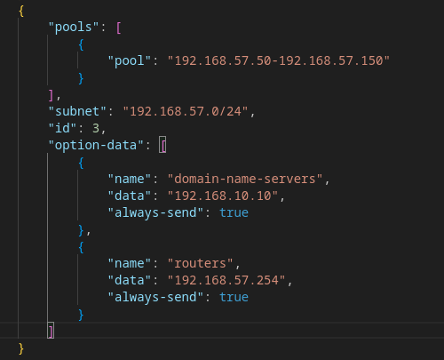

## Tarefa 2.2 - Servidores DHCP Linux

1.- Unha subrede para os equipos da rede privada stark.lan 192.168.10.0/24 con 2 pool. Un dos pool, asignará enderezos no rango entre .30 e .32 e outro no rengo ebtre .101 e .230. Estes deberán ter como único servidor DNS ao equipo Arya.

2.- Unha subrede para os equipos da rede privada lannister.lan 192.168.11.0/24

3.- Unha subrede para os equipos da rede privada targaryen.lan 192.168.57.0/24

4.- Fai que os log, se amosen no ficheiro /var/log/dhcp.log.

Toda la documentación [aquí](https://kea.readthedocs.io/en/kea-2.6.1/arm/logging.html)

Configuramos en el dhcp4.json los loggers:

Comprobamos logs con : kea-dhcp4 -t /dhcp/dhcp4.json o haciendo un cat /var/log/dhcp.log

5.- Deberás crear unha reserva estática que deberá de estar no rango de enderezos do seu pool correspondente (bran)

Como las MAC cambian cada vez que reiniciamos el equipo, incluimos a Bran en DHCP.

Desde el equipo le pedimos la ip con dhclient -v o dhclient -r

6.- Debe actualizarse mediante chaves a zona primaria no servidor DNS Arya.

Toda la documantación [aquí](https://manuais.pages.iessanclemente.net/apuntes/3.sistemas/dhcp/kea/20_actualizacions_dinamicas/index.html)

**IMPORTANTE:** Los archivos de zona deben tener permisos de bind. Por eso, en el entrypoint debemos darles permisos:

Añadimos la configuración en el DHCP, y añadimos la tsig-key. En ddns-domains añadimos los dominios, con su llave y su servidor DNS.

Por defecto, no se permiten actualizaciones, por lo que debemos de añadir lo siguiente en el dhcp4.json

Al finalizar la configuración, arrancamos el servicio con el comando kea-dhcp-ddns -d -c /etc/kea/kea-dhcp-ddns.conf

7.- Establece os nomes de dominio e servidores DNS de cada zona.

8.- Configura nos equipos Ned e Robb un servicio DHCP failover para a rede stark.lan e para lannister.lan

# Info Adicional

Los VPCS del GNS3 tienen dos comandos princiaples:
    
    - show: para mostrar la MAC
    - dhcp: para coger una dirección IP.

Para ver las concesiones en un equipo dhcp que recibió IP es en /var/lib/dhcp/dhclient.leases

Para ejecutar el entrypoint unicamente:

Configuración network router:

Para arrancar el relay en el router emplearemos el comando dhcrelay -d -i eth2 -i eth3 -i eth1 192.168.10.8

rsyslogd y después reiniciamos proceso y hacemos /var/log/syslog para ver lo que ocurre en el pc.

rnd sync -clean para después de un update en /var/cache/bind/db.stark.lan se actualice